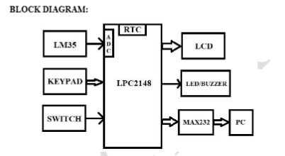

# Time-Stamped Sensor Data Logger using LPC2148

## Project Overview

This project implements a Time-Stamped Sensor Data Logger using the LPC2148 ARM7 microcontroller. The system continuously monitors temperature using the LM35 sensor, records measurements with real-time RTC timestamps, displays live data on a 16×2 LCD, and transmits the logged information through UART for monitoring 
and analysis.

## Objective

The objective of this project is to develop a **Time-Stamped Temperature Data Logger using the LPC2148 microcontroller** to continuously monitor temperature using an **LM35 sensor** and acquire the sensor data through the **ADC**. The system records and displays the temperature along with accurate **date and time information from the built-in RTC** on a **16×2 LCD** and transmits the timestamped temperature data to a PC through **UART** for logging and analysis. It also provides **temperature threshold monitoring and over-temperature alerts** when the temperature exceeds the predefined set point. A **keypad interface** is provided to allow the user to edit the **RTC date/time and temperature set point**, making the system suitable for reliable real-time temperature monitoring and data logging applications.

## Features

* **Real-Time Temperature Monitoring** – Continuously measures temperature using the LM35 sensor through the LPC2148 ADC.

* **RTC-Based Time Stamping** – Records each temperature reading along with accurate date and time information using the LPC2148 built-in RTC.

* **16×2 LCD Display** – Displays real-time temperature, date, time, and day information for easy monitoring.

* **UART Data Logging** – Transmits timestamped temperature readings to a PC or serial terminal through UART for logging and analysis.

* **Temperature Set-Point Monitoring** – Compares the measured temperature with a user-defined temperature threshold.

* **Over-Temperature Alert** – Activates an LED/buzzer and provides an alert through the serial terminal when the temperature exceeds the configured set point.

* **RTC Editing** – Allows the user to update the hour, minute, second, date, month, year, and day through the keypad.

* **Temperature Set-Point Editing** – Allows the user to modify the temperature threshold using the keypad.

* **Keypad-Based User Interface** – Provides a simple menu-based interface for configuring RTC parameters and the temperature set point.

* **Input Validation** – Ensures that the entered RTC values are within their permitted ranges.

* **Continuous Monitoring and Logging** – Continuously monitors temperature, maintains accurate time stamping, and transmits data for reliable tracking and analysis.


## Hardware Requirements

* **LPC2148 ARM7 Microcontroller**
* **LM35 Temperature Sensor**
* **16×2 LCD Display**
* **Matrix Keypad**
* **Push Button / Switch**
* **LED / Buzzer**
* **MAX232 Serial Communication Interface**

## Software Requirements

- Embedded C
- Keil uVision
- Flash Magic
- 
## Block Diagram

The block diagram of the **Time-Stamped Temperature Data Logger using LPC2148** is shown below.

 

## Working Principle

The system is based on the **LPC2148 ARM7 microcontroller** and continuously monitors temperature, timestamps the readings, displays the data, and logs it through UART.

1. **System Initialization**
   The LPC2148 initializes all required peripherals, including the **UART, RTC, ADC, 16×2 LCD, keypad, and alert devices**.

2. **Temperature Acquisition**
   The **LM35 temperature sensor** senses the surrounding temperature and produces an analog voltage proportional to the temperature. This analog signal is acquired and converted into a digital value using the **LPC2148 ADC**.

3. **RTC Data Acquisition**
   The microcontroller reads the current **time, date, and day** from its built-in **Real-Time Clock (RTC)**.

4. **Data Processing and Time Stamping**
   The measured temperature is combined with the RTC information to generate a **timestamped temperature record**.

5. **LCD Display**
   The current temperature and RTC information are displayed on the **16×2 LCD** for real-time monitoring.

6. **UART Data Logging**
   At configured intervals, the timestamped temperature data is transmitted to a **PC/serial terminal through UART** for monitoring, logging, and analysis.

7. **Temperature Threshold Monitoring**
   The measured temperature is continuously compared with the user-defined **temperature set point**.

8. **Over-Temperature Alert**
   If the measured temperature exceeds the configured set point, the **LED/Buzzer** is activated and an `ALERT` status is transmitted through UART. When the temperature returns to the safe range, the alert is cleared.

9. **User Configuration**
   A **push button/switch** is used to enter Edit Mode. The user can then use the **keypad** to modify RTC parameters such as hour, minute, second, date, month, year, and day, as well as the temperature set point.

10. **Input Validation and Update**
    The entered RTC values are checked to ensure they are within the permitted range. Valid values are then updated in the corresponding RTC registers.

11. **Continuous Operation**
    After completing the configuration, the system exits Edit Mode and resumes normal **temperature monitoring, RTC time stamping, LCD display, UART data logging, and over-temperature monitoring**.

    ## System Modules

### 1. LPC2148 ARM7 Microcontroller Module

Acts as the main controller of the system and coordinates temperature acquisition, RTC management, LCD display, keypad input, UART communication, and alert handling.

### 2. LM35 Temperature Sensor Module

Measures the surrounding temperature and provides an analog voltage proportional to the measured temperature.

### 3. ADC Module

Converts the analog output from the LM35 into a digital value that can be processed by the LPC2148.

### 4. RTC Module

Maintains the current **time, date, and day** and provides accurate timestamp information for each temperature reading. The RTC parameters can also be updated through the keypad.

### 5. 16×2 LCD Display Module

Displays the current **temperature, time, date, and day** for real-time local monitoring. It also displays user options during configuration.

### 6. Keypad Module

Provides user input for menu selection and allows the user to edit **RTC parameters and the temperature set point**.

### 7. UART Communication Module

Provides serial communication between the LPC2148 and a PC/serial terminal. It transmits **timestamped temperature data and alert messages** for monitoring and logging.

### 8. MAX232 Interface Module

Provides the required **voltage-level conversion** between the LPC2148 UART signals and the PC serial interface.

### 9. Temperature Monitoring and Alert Module

Continuously compares the measured temperature with the configured set point. When the temperature exceeds the threshold, it activates the **LED/Buzzer** and sends an `ALERT` status through UART.

### 10. Switch / Push Button Module

Detects the user's button press and provides access to the **Edit Mode**, where the RTC information and temperature set point can be configured using the keypad.                  

## RTC & Temperature Set-Point Editing

The system provides a **keypad-based editing interface** that allows the user to modify the RTC information and temperature set point. A push button is used to enter the editing mode, while the keypad is used for menu selection and value entry.

### Entering Edit Mode

* The user presses the **push button/switch** to enter Edit Mode.
* The LCD displays the available editing options.
* The user selects the required option using the **keypad**.

### RTC Editing

The user can modify the following RTC parameters:

* Hour
* Minute
* Second
* Day
* Month
* Year
* Weekday

The entered values are **validated** to ensure they are within the permitted range. Valid values are then updated in the corresponding **LPC2148 RTC registers**.

### Temperature Set-Point Editing

* The user selects the **Temperature Set Point** option from the edit menu.
* A new temperature threshold is entered using the keypad.
* The updated set point is then used for **over-temperature monitoring and alert generation**.

### Exit Edit Mode

After completing the required changes, the user selects the **Exit** option. The system then returns to normal operation and continues **temperature monitoring, RTC time stamping, LCD display, UART data logging, and threshold monitoring**.     
## Alert & Fault Handling

The system continuously monitors the temperature measured by the **LM35 sensor** through the LPC2148 ADC and compares it with the configured **temperature set point**.

* **Normal Condition:** When the measured temperature is within the safe limit, the system continues normal temperature monitoring, timestamp display, and UART data logging.
* **Over-Temperature Detection:** When the measured temperature exceeds the configured set point, the system identifies an over-temperature condition.
* **Local Alert:** The **LED/Buzzer** is activated to provide an immediate visual and audible indication of the fault condition.
* **UART Alert:** An `ALERT` message containing the **measured temperature, date, and time** is transmitted to the PC through UART.
* **Alert Clearing:** When the temperature returns to the safe range, the LED/Buzzer is turned off and the alert condition is cleared.
* **Continuous Operation:** After the fault condition is cleared, the system resumes normal temperature monitoring, timestamping, display, and data logging.

This alert mechanism provides **real-time over-temperature detection, immediate local indication, and timestamped remote notification** through the serial interface.

## Pin Configuration

| Peripheral              | LPC2148 Pin / Interface |
| ----------------------- | ----------------------- |
| LM35 Temperature Sensor | ADC Input               |
| 16×2 LCD                | GPIO                    |
| 4×4 Keypad              | GPIO                    |
| Push Button / Switch    | GPIO                    |
| UART TX                 | UART0 TXD               |
| UART RX                 | UART0 RXD               |
| RTC                     | Built-in RTC            |
| LED / Buzzer            | GPIO                    |
| MAX232                  | UART0 Interface         |

> Pin assignments may vary depending on the hardware implementation.

## Project Structure

```text
Time-Stamped-Sensor-Data-Logger/
│
├── main_t.c
├── uart0_t.c
├── uart0_t.h
├── adc_t.c
├── adc_t.h
├── rtc_t.c
├── rtc_t.h
├── lcd_t.c
├── lcd_t.h
├── keypad_t.c
├── keypad_t.h
├── delay_t.c
├── delay_t.h
├── Block_Diagram.jpeg
└── README.md
```

## Build and Flash

1. Open the project in **Keil µVision**.
2. Select the **LPC2148** microcontroller.
3. Add all required source and header files to the project.
4. Configure the required compiler and target settings.
5. Build the project and generate the HEX file.
6. Connect the LPC2148 development board to the PC.
7. Use **Flash Magic** to erase, program, and verify the generated HEX file.
8. Reset the microcontroller and start the application.

## System Operation

1. Power on the LPC2148 system.
2. The microcontroller initializes the ADC, RTC, LCD, keypad, UART, and alert devices.
3. The LM35 continuously measures the temperature.
4. The ADC converts the LM35 analog output into a digital value.
5. The RTC provides the current date and time.
6. The temperature and timestamp are displayed on the LCD.
7. Timestamped temperature data is transmitted to the PC through UART.
8. The measured temperature is compared with the configured set point.
9. If the temperature exceeds the set point, the LED/Buzzer is activated and an `ALERT` message is transmitted.
10. The push button allows the user to enter Edit Mode and modify the RTC information or temperature set point.
11. After editing, the system resumes normal monitoring and logging.

## UART Output

The system transmits timestamped temperature information through UART to a PC or serial terminal.

Example output format:

```text
Date: 12/08/2026
Time: 13:05:24
Day: Wednesday
Temperature: 32 C
Status: NORMAL
```

When the temperature exceeds the configured set point:

```text
Date: 12/08/2026
Time: 13:06:10
Day: Wednesday
Temperature: 41 C
Status: ALERT
```

> The above UART outputs are examples of the expected format and are not actual hardware screenshots.

## Applications

* Temperature monitoring systems
* Industrial equipment monitoring
* Laboratory temperature logging
* Server and equipment monitoring
* Environmental monitoring
* Storage and warehouse temperature monitoring
* Embedded data-logging applications

## Advantages

* Real-time temperature monitoring
* RTC-based time stamping
* Continuous data logging through UART
* Configurable temperature threshold
* Immediate over-temperature indication
* User-configurable RTC and temperature set point
* Simple LCD and keypad interface
* Suitable for embedded monitoring applications

## Limitations

* LM35 provides temperature measurement only and does not support humidity monitoring.
* UART logging requires a wired serial connection to the PC.
* Accurate timestamping depends on proper RTC configuration.
* The system does not provide wireless or cloud-based data logging.

## Future Enhancements

* Replace UART/serial logging with **Wi-Fi or GSM-based remote monitoring**.
* Add cloud-based storage and visualization of temperature data.
* Add an SD card for local data storage.
* Add additional sensors such as humidity and pressure sensors.
* Provide graphical temperature trends.
* Add automatic notification through SMS or mobile applications.
* Add battery backup for maintaining RTC operation during power failure.

## Conclusion

The **Time-Stamped Sensor Data Logger using LPC2148** provides an embedded solution for real-time temperature monitoring and logging. The system combines the **LM35 temperature sensor, LPC2148 ADC, built-in RTC, 16×2 LCD, keypad, UART, and alert mechanism** to measure, timestamp, display, and transmit temperature data. The configurable temperature set point and over-temperature alert provide additional fault monitoring, making the system suitable for various temperature-monitoring and data-logging applications.

## Author

**Jeena Susan Kurian*


- Set-Point Editing
